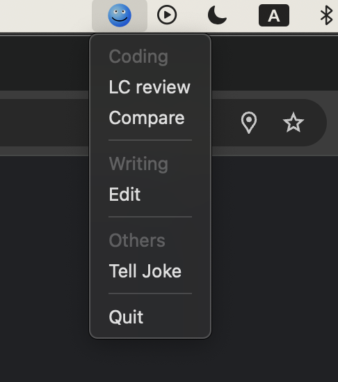

# 2506-llm-prompt-template-manager
This is a simple Mac desktop menu bar app that helps you organize the prompts you regularly use.

You may have prompts you frequently use when interacting with LLMs, each serving different purposes. This app helps you retrieve those templates efficiently.

Here's a starting point for your mental map when working with LLMs daily. This is how you can keep your prompt templates organized in `prompts.txt`.

Example:
```
### Coding
LC review:::Please assess my code for a Leetcode question from the perspective of an interview, and provide feedback.

Compare:::Compare these two versions of code. Explain the differences to me. Use examples when necessary and let me know which would be better for a tech interview.

### Writing
Edit:::Please edit this text. Do not change any content details; focus only on the language. Smooth out any expression that may read awkward or unnatural, and fix any grammar issues. This will help me as a non-native speaker.

### Others
Tell Joke::: Hey, can you tell me a joke to lighten up my mood? It's been such a long day, and I'm tried. Include a number that matches today’s date in the joke. Be creative.
```
Each `###` marks a category name. The label shown in the dropdown menu precedes the actual template, separated by `:::`.

You can launch the app as a standalone macOS app by using `setup.py`. After running the setup, the final product will be available in the `dist` folder.

Here’s the design of the app icon, created during a relaxed and fun collaboration with Gemini. Its cheerful smile looks great in the top-right corner of your Mac’s toolbar. This lightweight application runs smoothly and helps you keep your prompt templates well organized!

<div style="display: flex; justify-content: center; align-items: center; height: 300px;">
  
  
</div>

Let me know if you have any suggestions.

~Linly


---
Requires Python version 3.9 or later. Can run `requirements.txt` to make sure you set up a proper environment.
`pip install -r requirements.txt`

Disclaimer: this coding project was done in collaboration with both ChatGPT and Gemini.